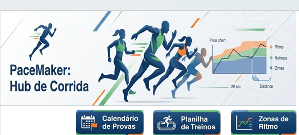

# 🏃‍♂️ PaceMaker - Hub de Planejamento e Performance para Corredores

Este projeto foi desenvolvido como entrega para o desafio prático de ferramentas de planilhas na **DIO (Digital Innovation One)**. O objetivo foi construir um agregador de dados robusto focado em corrida de rua, aplicando conceitos de estruturação de dados, validações automatizadas e design de dashboards (UX/UI).

O sistema centraliza o calendário de provas, gerencia a planilha de treinos semanal com dados reais de corridas em Curitiba e calcula automaticamente as zonas de ritmo (Pace) para treinos de performance.

---

## 🎨 Interface do Sistema

---

## 🛠️ Engenharia de Dados & Recursos Aplicados

O sistema foi inteiramente construído utilizando o Microsoft Excel e conta com as seguintes implementações técnicas:

*   **Menu de Navegação Dinâmico (Dashboard):** Sistema de cabeçalho integrado por camadas e hiperlinks internos, simulando a interface de um software profissional (com as guias de abas nativas ocultadas).
*   **Identificação Visual de Aba Ativa (UX):** Uso de camadas de formas geométricas bloqueando o clique e ocultando o botão da página atual, indicando visualmente onde o usuário está navegando.
*   **Validação de Dados Automatizada:** Uso de listas suspensas (`Data Validation`) para padronização de tipos de treinos (Longão, Tiros, Ritmo, Regenerativo) e distâncias de provas, eliminando erros de digitação humana.
*   **Fórmulas Lógicas e de Tratamento de Tempo:** 
    *   Tratamento de horas/minutos em formato de duração (`hh:mm:ss` e `mm:ss`) para cálculo automático de Pace de corrida.
    *   Fórmula com tratamento de erros (`=SE(E16>0; F16 / E16; "")`) para evitar erros de divisão por zero (`#DIV/0!`) ou conflitos de dados de texto puro.
    *   Análise lógica encadeada na coluna de Status (`=SE(E16=""; ""; SE(E16>=D16; "Concluído"; "Incompleto"))`).
*   **Calculadora de Zonas de Treinamento:** Sistema inteligente que usa percentuais matemáticos de tempo para projetar os ritmos exatos de corrida baseados em um tempo de referência atual (Z1 a Z5).
*   **Segurança e Blindagem:** Aplicação de regras de proteção de células em nível de planilha, liberando apenas os campos de digitação de dados e bloqueando a edição ou exclusão acidental de fórmulas e layouts.

---

## 🗂️ Estrutura do Repositório

*   `/PaceMaker_Dashboard.xlsx` - Arquivo finalizado e protegido com dados reais de treinamento.
*   `/images` - Pasta contendo as capturas de tela demonstrando o funcionamento do sistema e a validação das regras.
*   `README.md` - Documentação técnica do projeto.

---
Desenvolvido por Luiz Suto durante a Formação DIO.

